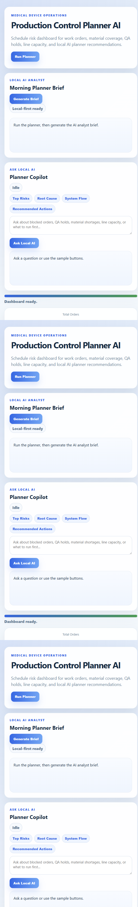

# FPGA IP Integration Architecture Lab

FPGA IP Integration Architecture Lab is a local architecture-risk tool for reviewing IP blocks, interface compatibility, clock/reset strategy, verification coverage, and integration readiness.

## Product Screenshot



It combines deterministic FPGA integration scoring with a local AI analyst that explains design risk and recommends next engineering actions.

## What It Does

- Loads FPGA IP integration scenarios from sample data.
- Scores integration risk across interfaces, clocks, resets, dependencies, and verification signals.
- Identifies blockers and high-risk subsystems.
- Displays a browser dashboard for architecture review.
- Adds local AI triage guidance for engineering next steps.

## AI Features

- Local AI analyst explains integration risk in engineering language.
- AI guidance references deterministic score fields and blockers.
- Helps convert raw architecture checks into action plans.
- Supports question-driven review from the browser UI.

## Architecture

```text
IP integration data
      |
      v
Deterministic risk scoring -> subsystem blockers -> readiness summary
      |
      v
Local AI analyst -> triage explanation + recommended fixes
      |
      v
Browser dashboard
```

## Run

```powershell
run.bat
```

## Local AI Setup

Use a local OpenAI-compatible model server such as LM Studio. The project defaults to a small local model like `google/gemma-4-e4b`.

The risk score is deterministic and remains available without AI.

## Main Files

- `server.py` - local API and AI insight endpoint.
- `web/index.html` - browser dashboard.
- `agents/Agent.md` - FPGA architecture copilot instructions.
- `samples/` - integration scenario data.

## Output

The tool produces integration readiness scores, blocker summaries, subsystem risk notes, and AI-generated triage recommendations.
